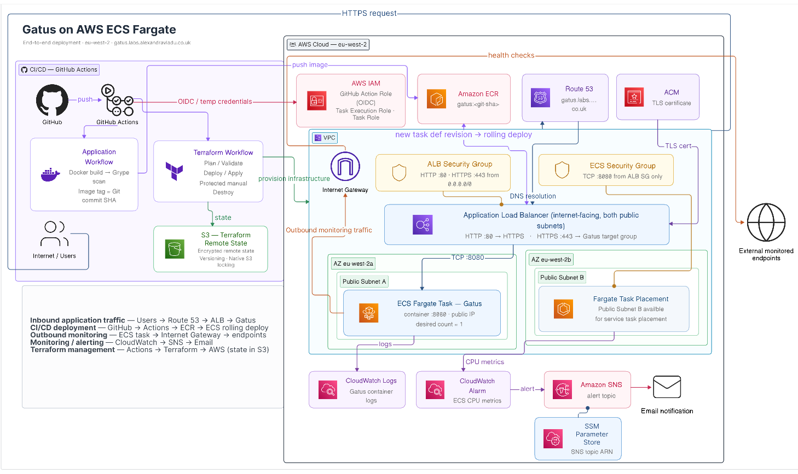
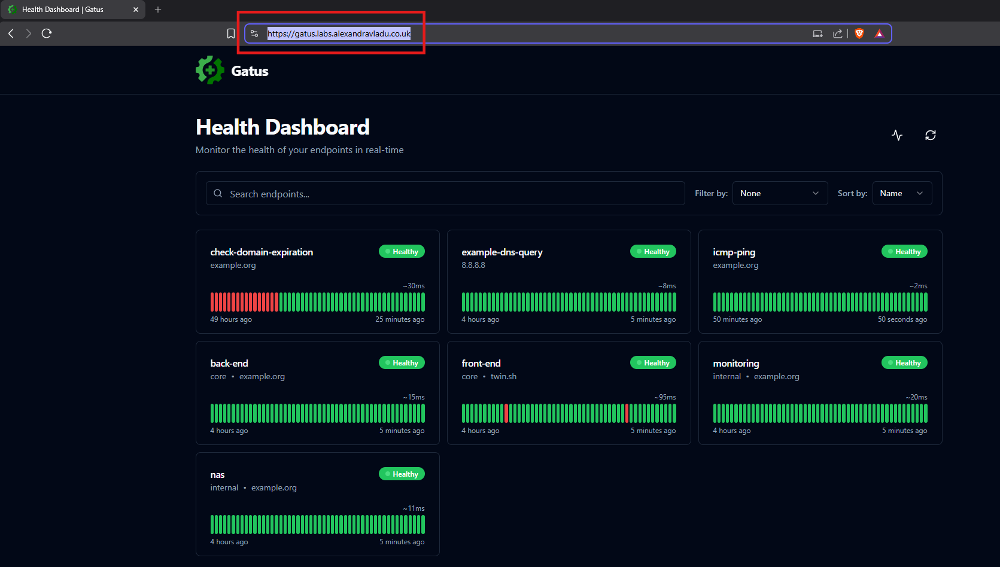
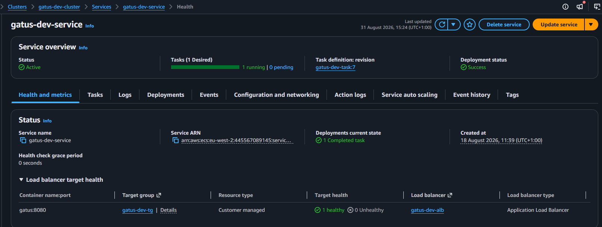
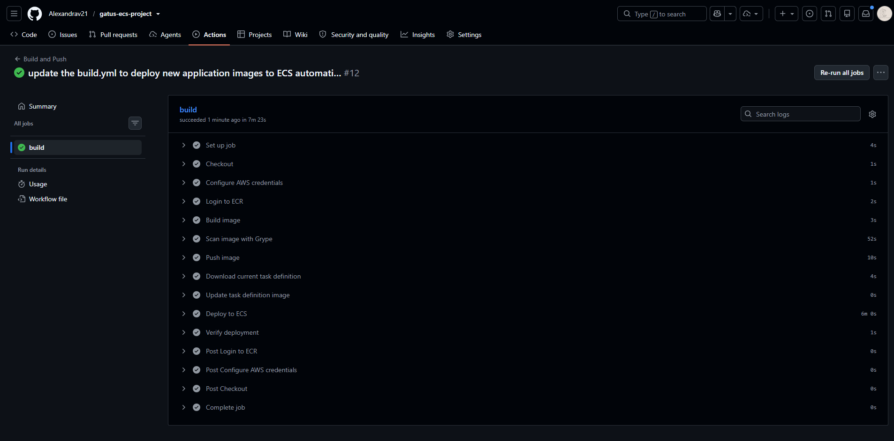
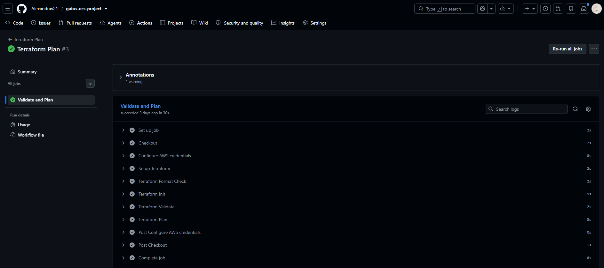
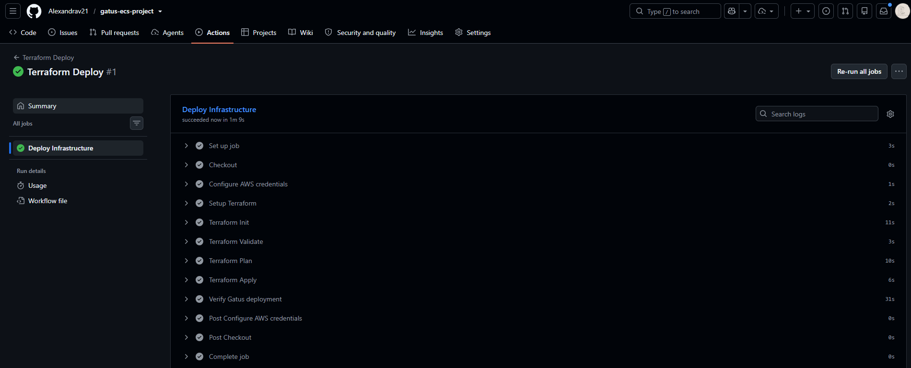
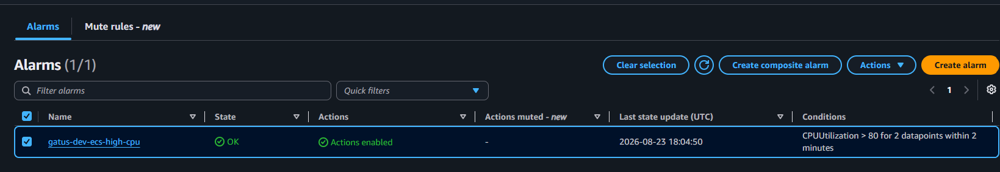
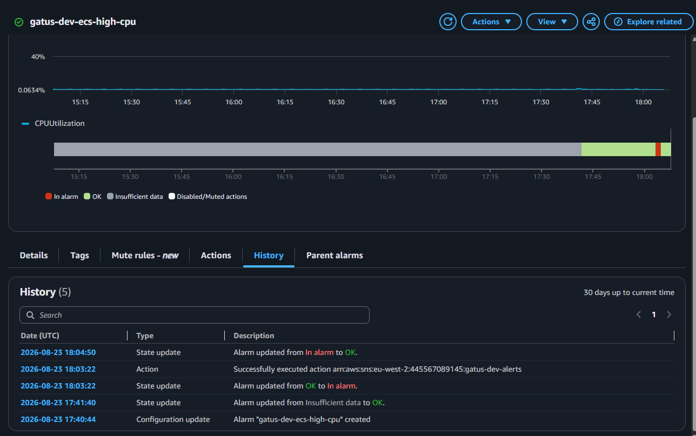
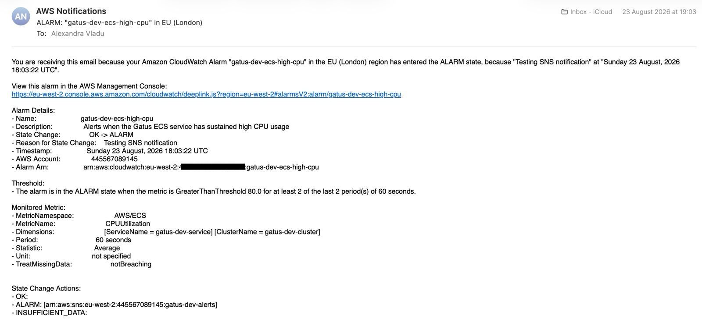
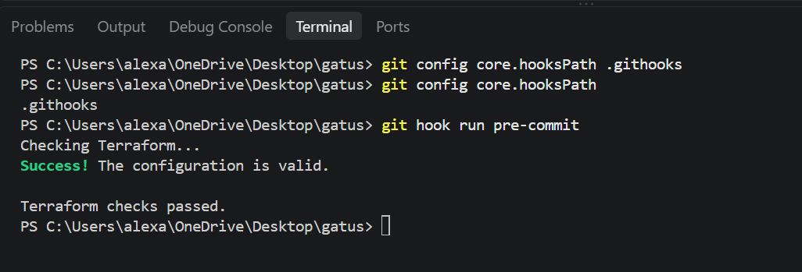

# Gatus on AWS ECS Fargate

## Technology Stack

### AWS & Infrastructure


### Infrastructure as Code & Containers


### CI/CD & Security


### Development


An end-to-end deployment of **Gatus on AWS ECS Fargate**, built with
Terraform and automated through GitHub Actions.

The project covers containerisation, networking, HTTPS, monitoring and
alerting, infrastructure as code, secure AWS authentication and
automated application and infrastructure deployments.

### Live Application

🌐 **[View Gatus running on AWS ECS Fargate](https://gatus.labs.alexandravladu.co.uk/)**

## Architecture



The application runs on ECS Fargate across two public subnets and is
exposed through an Application Load Balancer, with Route 53 and ACM
providing DNS and HTTPS.

ECS tasks accept application traffic only from the ALB security group,
while outbound internet access allows Gatus to monitor external
endpoints without requiring a NAT Gateway.

GitHub Actions authenticates to AWS through OIDC, builds SHA-tagged
images into ECR and performs rolling ECS deployments. Terraform manages
the infrastructure using remote S3 state, while CloudWatch and SNS
provide monitoring and email alerting.

## Repository Structure

The repository separates the application, infrastructure and CI/CD
configuration so each part of the project has a clear responsibility.

``` text
gatus-ecs-project/
│
├── .github/
│   └── workflows/
│       ├── build.yml
│       ├── deploy.yml
│       ├── terraform.yml
│       └── terraform-destroy.yml
│
├── .githooks/
│   └── pre-commit
│
├── .vscode/
│   ├── extensions.json
│   └── settings.json
│
├── assets/
│   ├── architecture/
│   ├── application/
│   ├── cicd/
│   ├── development/
│   └── monitoring/
│
├── GatusApp/
│   ├── config/
│   │   └── config.yaml
│   └── Dockerfile
│
├── infra/
│   ├── modules/
│   │   ├── acm/
│   │   ├── alarms/
│   │   ├── alb/
│   │   ├── alerting/
│   │   ├── ecr/
│   │   ├── ecs/
│   │   ├── iam/
│   │   ├── monitoring/
│   │   ├── route53/
│   │   ├── security-groups/
│   │   └── vpc/
│   │
│   ├── backend.tf
│   ├── main.tf
│   ├── outputs.tf
│   ├── provider.tf
│   └── variables.tf
│
├── .dockerignore
├── .gitignore
└── README.md
```

The structure is deliberately split into three main areas:

-   **`GatusApp/`** contains the application configuration and Docker
    setup.
-   **`infra/`** contains the Terraform root configuration and reusable
    infrastructure modules.
-   **`.github/workflows/`** contains the application build, Terraform
    plan, deployment and protected destroy pipelines.

Local development tooling is also included through **`.githooks/`** for
Terraform pre-commit checks and **`.vscode/`** for shared Terraform and
YAML formatting settings.

## 1. Project Kickoff

The goal of this project was to deploy **Gatus on AWS ECS Fargate** and
take it from a manual deployment all the way to a secure, automated
end-to-end solution.

I started with **ClickOps in the AWS Console** before moving to
Terraform. Building the first version manually helped me understand how
the VPC, ALB, ECS, ECR, IAM and CloudWatch pieces connected before
recreating them as code.

I also kept the same verification process throughout the project:

> **Plan → review → apply → verify in AWS**

Before applying Terraform changes, I checked that the plan contained
only the changes I expected and no unexpected destruction. After
applying, I manually verified the relevant resources in AWS and checked
that the application remained healthy.

Changes were committed gradually rather than bundled into huge commits,
which kept the Git history readable and made troubleshooting or
reverting individual stages much easier.

From there, the project grew into a complete setup covering **Terraform,
HTTPS, monitoring and alerting, OIDC authentication, container security
scanning and automated CI/CD deployments**.

## 2. Architecture and Design Decisions

Before rebuilding the environment with Terraform, I made a few
deliberate decisions around **cost, security, maintainability and
simplicity**.

I wanted to push myself beyond simply getting an application running on
ECS and build this as a proper end-to-end project, covering everything
from networking and infrastructure as code to monitoring, security and
CI/CD.

At the same time, I did not want to add AWS services simply because they
are commonly used in production architectures. Every component needed to
have a reason for being there.

### Cost-conscious networking

One of the biggest decisions was running the ECS Fargate tasks in
**public subnets with public IPs**, rather than placing them in private
subnets behind a NAT Gateway.

A common alternative would be:

``` text
Internet
   ↓
Public ALB
   ↓
Private ECS tasks
   ↓
NAT Gateway
   ↓
Internet
```

For this project, I chose:

``` text
Internet
   ↓
Public ALB
   ↓
Public ECS tasks
   ↓
Internet Gateway
```

A NAT Gateway would provide additional network isolation, but it would
also introduce a continuous hourly cost plus data processing charges.

The public IP does **not** mean the application container is simply open
to the internet. The ECS security group accepts application traffic on
port `8080` only from the ALB security group.

This gives Gatus the outbound internet access it needs to monitor
external endpoints without adding another always-on service.

And considering this supposedly "cost-conscious" project still managed
to reach roughly \$25 while I was building it, I am quite happy I did
not add another permanently billed service.

### Built with a security-first mindset

Alongside cost optimisation, this project was built with a
**security-first mindset**. I wanted security to influence the
architecture from the beginning rather than become something added at
the end.

Some of the main security decisions included:

-   separate security groups for the ALB and ECS tasks;
-   HTTPS through ACM, with HTTP redirected to HTTPS;
-   IAM permissions limited to what each component needs;
-   GitHub Actions authentication through **OIDC and temporary AWS
    credentials** instead of long-lived access keys;
-   an OIDC trust policy restricted to the specific GitHub repository;
-   encrypted Terraform state in S3 with versioning and native state
    locking;
-   container vulnerability scanning with Grype;
-   CloudWatch monitoring connected to SNS email alerts.

The idea was simple: **security should be part of how the project is
designed, deployed and maintained, not a separate checkbox at the end.**

### Keeping Terraform modular without going overboard

I wanted the Terraform code to stay readable as the project grew.

Infrastructure was split into logical modules rather than creating a
module for every individual AWS resource.

Where it made sense, I also used `count` and `for_each` instead of
duplicating resources manually. For example, the VPC module creates
multiple public subnets and route table associations dynamically, while
ACM validation records use `for_each`.

This helped keep the Terraform **DRY, maintainable and easier to reason
about**, without turning the project into a maze of tiny modules.

## 3. Application and Containerisation

I used **Gatus**, an open-source health monitoring application, as the
workload. Rather than including the upstream source code, I kept the
application layer focused on the configuration and container setup I
actually manage.

### Live application



Gatus running successfully over the custom HTTPS endpoint.

### ECS service health



The ECS Fargate service running with the application healthy behind the load balancer.

The Dockerfile extends the official Gatus image and adds my monitoring
configuration:

``` dockerfile
FROM twinproduction/gatus:latest

COPY GatusApp/config/config.yaml /config/config.yaml

ENV GATUS_CONFIG_PATH=/config/config.yaml

EXPOSE 8080
```

Since the official image already contains the compiled application, I
chose not to add a multi-stage build purely for the sake of having one.

### Container security

Images are scanned with **Grype** during CI, making High and Critical
vulnerabilities inherited from upstream dependencies visible during
every build.

I also compared the current Gatus image against a pinned release, but
the pinned version returned significantly more findings, including
Critical vulnerabilities. Based on those scan results, I kept the
current upstream image for this project.

For a long-running production workload, I would introduce a formal image
upgrade and remediation process and pin a reviewed version or digest.

## 4. Infrastructure as Code with Terraform

I rebuilt the AWS environment with **Terraform**, keeping the
infrastructure split into logical modules rather than one huge
configuration.

  Module                    Responsibility
  ------------------------- ---------------------------------------------------
  `vpc`                     VPC, public subnets, routing and Internet Gateway
  `security-groups`         ALB and ECS network access
  `iam`                     ECS roles and GitHub Actions OIDC permissions
  `ecr`                     Container repository
  `alb`                     Load balancer, target group and HTTPS listeners
  `ecs`                     Fargate cluster, task definition and service
  `acm` / `route53`         TLS certificate and DNS
  `monitoring` / `alarms`   CloudWatch logs and ECS CPU alarm
  `alerting`                SNS notifications and SSM Parameter Store

### Terraform state

Terraform state is stored remotely in **Amazon S3** with encryption,
versioning and native S3 state locking:

``` hcl
use_lockfile = true
```

I deliberately used native S3 locking rather than the older
DynamoDB-based approach, keeping the backend simpler while still
protecting against concurrent state changes.

### Keeping the code DRY

Where multiple similar resources were required, I used Terraform's
dynamic features instead of duplicating blocks. `count` creates the
public subnets and route table associations, while `for_each` handles
ACM DNS validation records.

Infrastructure changes followed the same workflow throughout the
project:

> **`fmt` → `validate` → `plan` → review → `apply` → verify in AWS**

Infrastructure was also committed gradually, keeping the Git history
readable and individual changes easier to troubleshoot or revert.

## 5. CI/CD with GitHub Actions

The project uses **GitHub Actions** for application and infrastructure
CI/CD through four workflows:

  ---------------------------------------------------------------------
  Workflow                           Purpose
  ---------------------------------- ----------------------------------
  `build.yml`                        Builds and scans the image, pushes
                                     it to ECR and deploys it to ECS

  `terraform.yml`                    Runs Terraform formatting,
                                     validation and plan checks

  `deploy.yml`                       Applies Terraform changes and
                                     verifies the HTTPS endpoint

  `terraform-destroy.yml`            Protected manual infrastructure
                                     teardown
  ---------------------------------------------------------------------

### Secure AWS authentication with OIDC

GitHub Actions authenticates to AWS using **OIDC**, meaning no
long-lived AWS access keys are stored in GitHub.

The trust relationship is restricted to this repository, and workflows
receive temporary AWS credentials only when required.

### Application deployment

Each build is tagged with the **Git commit SHA**, creating direct
traceability between source code, the ECR image and the running ECS
task:

``` text
Git commit
    ↓
Docker build → Grype scan
    ↓
ECR :<commit-sha>
    ↓
New ECS task definition
    ↓
Rolling ECS deployment
    ↓
HTTPS health check
```

The pipeline waits for the ECS service to become stable before checking
the public endpoint, so a successful workflow verifies the deployment
rather than simply pushing an image.

### Pipeline evidence



The application pipeline builds the image, runs the Grype scan, pushes the SHA-tagged image to ECR and performs the ECS deployment.

<p align="center">
  
  <br />
  
</p>

Terraform planning and deployment are kept as separate successful workflows.

### Safer infrastructure changes

Terraform planning and deployment are separate. Infrastructure can be
reviewed before it is applied, while destruction requires a manual
workflow and explicit `DESTROY` confirmation.

## 6. Monitoring and Alerting

ECS application logs are sent to **CloudWatch** with a seven-day
retention period to avoid keeping unnecessary logs indefinitely.

Infrastructure alerting follows a simple path:

``` text
ECS CPU metric
      ↓
CloudWatch Alarm
      ↓
SNS
      ↓
Email
```

The alert was tested end-to-end by temporarily triggering the `ALARM`
state through the AWS CLI. An SNS email was received successfully, after
which CloudWatch evaluated the real ECS metrics and returned the alarm
to `OK`.

### Monitoring evidence

<p align="center">
  
  <br />
  
</p>



The alarm test confirmed the full path from ECS metrics to CloudWatch and SNS email notification, followed by the alarm returning to `OK`.

## 7. Branch Protection and Contribution Workflow

The `main` branch is protected and is treated as the stable,
review-ready version of the project.

Changes should follow this workflow:

``` text
Create a branch
      ↓
Make and test changes
      ↓
Open a pull request
      ↓
CI checks run
      ↓
Code review and approval
      ↓
Merge into main
```

Contributors cannot push changes directly to `main`. They must work from
a separate branch and open a pull request for review before the change
can be merged.

I follow the same workflow myself. Any future features, fixes or
improvements will be developed on branches and merged through pull
requests rather than pushed directly to `main`. This keeps the main
branch protected and gives Terraform and CI/CD checks a chance to run
before changes are accepted.

Repository branch rules are configured so that pull requests and review
are required before merging. For external contributions, I remain the
reviewer responsible for approving changes.

## 8. Getting Started

### Prerequisites

To work with the project locally, you will need:

-   Git
-   Docker
-   Terraform
-   AWS CLI
-   an AWS account with the required permissions
-   VS Code is recommended, but not required

The repository includes recommended VS Code extensions and
format-on-save settings for **Terraform and YAML** through
`.vscode/extensions.json` and `.vscode/settings.json`.

### Clone the repository

``` bash
git clone https://github.com/Alexandrav21/gatus-ecs-project.git
cd gatus-ecs-project
```

### Run Gatus locally

Build the application image from the repository root:

``` bash
docker build -f GatusApp/Dockerfile -t gatus:local .
```

Run the container:

``` bash
docker run --rm -p 8080:8080 gatus:local
```

Gatus will then be available at:

``` text
http://localhost:8080
```

### Enable the Terraform pre-commit hook

The repository includes a Git hook that runs Terraform formatting and
validation checks before commits.

Enable it once after cloning:

``` bash
git config core.hooksPath .githooks
```

Test it manually with:

``` bash
git hook run pre-commit
```

The hook checks Terraform formatting and validates the configuration
before allowing a commit to continue.



### Working with Terraform locally

Terraform configuration lives under:

``` text
infra/
```

Local AWS authentication is handled through the AWS CLI rather than
credentials stored in the repository.

For example, in PowerShell with an existing AWS CLI profile:

``` powershell
$env:AWS_PROFILE = "your-profile"
$env:TF_VAR_notification_email = "your-email@example.com"
```

Then:

``` powershell
cd infra
terraform init
terraform fmt -recursive
terraform validate
terraform plan
```

Review the plan before applying any infrastructure changes:

``` powershell
terraform apply
```

> **Note:** The Terraform backend uses an existing S3 bucket for remote
> state. Anyone reproducing the infrastructure in another AWS account
> should update the backend configuration and project-specific values
> before running Terraform.

## Release

The completed V1 implementation is published as:

> **`v1.0.0` → End-to-end Gatus deployment on AWS ECS Fargate**

This release marks the **review-ready version of the project**, bringing together the complete end-to-end implementation: Terraform-managed AWS infrastructure, HTTPS, monitoring and alerting, secure OIDC authentication, application and infrastructure CI/CD, Git SHA-tagged ECS deployments, container vulnerability scanning, and protected infrastructure teardown.

With V1 complete, any future features, fixes or improvements will be developed through the protected branch and pull request workflow rather than pushed directly to `main`.


## Future Improvements

If I continued developing the project beyond V1, I would consider:

-   moving ECS tasks into private subnets where the additional NAT
    Gateway or VPC endpoint cost is justified;
-   introducing ECS Service Auto Scaling based on demand;
-   pinning and regularly updating the Gatus image as part of a defined
    vulnerability remediation process;
-   making High and Critical vulnerability findings a blocking CI/CD
    gate once upstream dependency management is under tighter control;
-   introducing separate development, staging and production
    environments with deployment approvals;
-   further reducing the GitHub Actions IAM permissions instead of
    relying on broader `PowerUserAccess` for Terraform operations;
-   adding automated Terraform drift detection;
-   expanding monitoring beyond CPU utilisation with additional
    service-level alarms.


